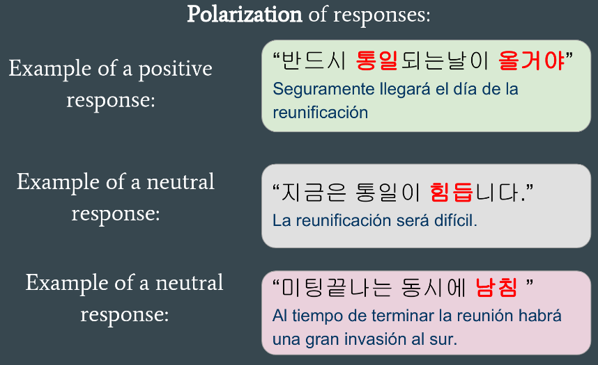
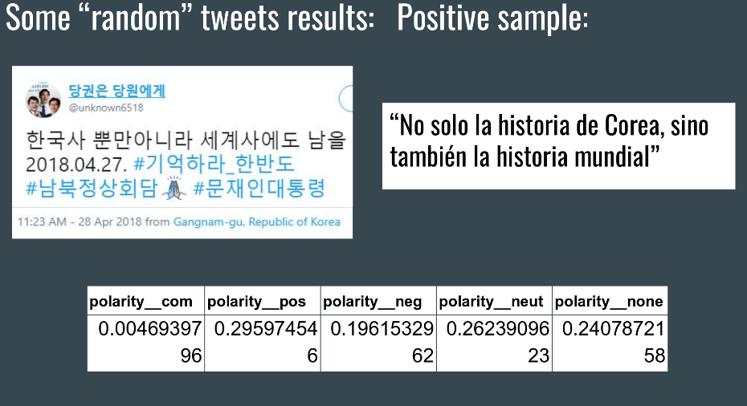
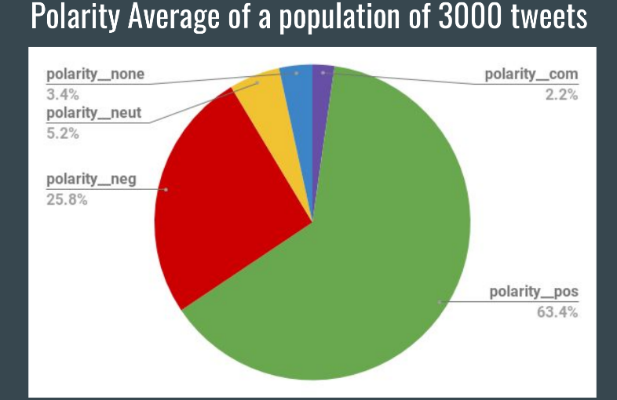
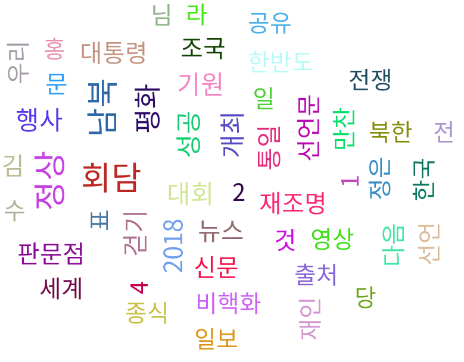
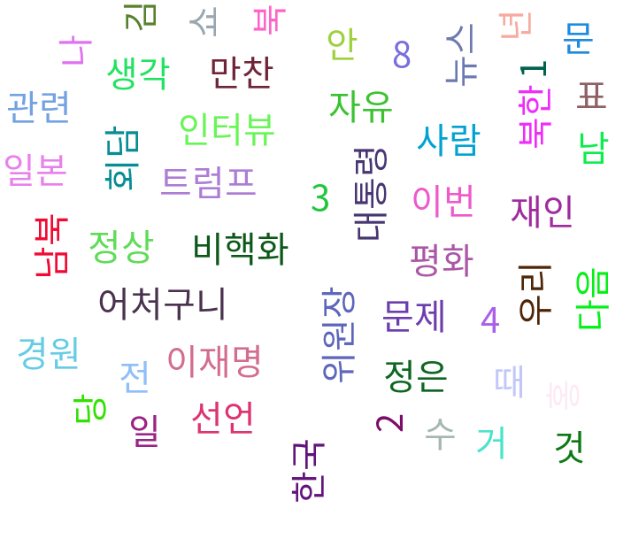

# KSentimentAnalysis
This is a sentiment Analysis of the twitter responses to the recently Korean summit using Natural Languaje Processing: [Konlpy](https://github.com/konlpy/konlpy). 

Feel free to read in detail about the [analysis here.](https://github.com/jiapulidoar/KSentimentAnalysis/blob/master/Jimmy.pdf) 

# 27th april, 2018 inter-Korean summit 

## Polarization of responses 

## Example of one comment:

## Analysis of 3k tweets:

## World cloud of the most used positive words

## World cloud of the most used neative words

